# Instrucciones para el despliegue

|              | |
| ------------------------ | ------------- |
| **Nombre del Proyecto**  | PetFun        |
| **Código del Proyecto**  | 2025-3.14     |
| **Fecha de Elaboración** | 23/11/2025    |

Despliegue del producto: https://josemamg.pythonanywhere.com  

Esta guía explica primero como correr el proyecto en local y luego cómo desplegar el proyecto PetFun para su puesta en produccion.

# **Índice**
- A. Guía de instalación y migración (PetFun)
- B. Guía de despliegue de proyecto

# A. Guía de instalación y migración (PetFun)

Esta guía explica cómo preparar el entorno, aplicar migraciones y poner datos de prueba para el proyecto PetFun.

## Requisitos

- Python 3.12
- pip
- PowerShell (Windows)
- Opcional: VS Code con la extensión de Python

## 1. Clonar el repositorio

```powershell
git clone https://github.com/Manuelgithuv/PetFun.git
cd PetFun
```

## 2. Crear y activar entorno virtual

```powershell
python -m venv .venv
.\.venv\Scripts\Activate.ps1
```

Si PowerShell bloquea la ejecución de scripts, habilita:
```powershell
Set-ExecutionPolicy -Scope CurrentUser -ExecutionPolicy RemoteSigned
.\.venv\Scripts\Activate.ps1
```

## 3. Instalar dependencias


```powershell
pip install -r requirements.txt
```

## 4. Configurar variables (desarrollo)

- `DEBUG` está activado por defecto.
- Base de datos SQLite lista por defecto (`db.sqlite3`).
- Soporte `.env`: el proyecto carga variables desde un archivo `.env` en la raíz.

## 5. Migraciones (base de datos)

Si ya existe una base de datos previa y vas a cambiar de modelo de usuario, borra `db.sqlite3` antes de migrar:
```powershell
if (Test-Path .\db.sqlite3) { Remove-Item .\db.sqlite3 -Force }
```

Aplica migraciones desde cero:
```powershell
python manage.py migrate
```

Esto creará:
- Tablas del sistema (`auth`, `admin`, `sessions`, etc.).
- El modelo de usuario personalizado (`accounts.User`).
- Usuarios de prueba gracias a la migración `accounts/0002_seed_users.py`:
  - demo1@example.com / demo12345
  - demo2@example.com / demo12345

## 6. Crear superusuario (opcional)

```powershell
python manage.py createsuperuser
```

## 7. Ejecutar el servidor de desarrollo

```powershell
python manage.py runserver
```

- Home: http://127.0.0.1:8000/
- Login: http://127.0.0.1:8000/login/
- Registro: http://127.0.0.1:8000/register/
- Mi cuenta: http://127.0.0.1:8000/account/
- Admin: http://127.0.0.1:8000/admin/

## 8. Datos de prueba

- Usa los usuarios demo incluidos o crea nuevos desde `/register` o el panel `/admin`.
- En `/account/` puedes editar el perfil, cambiar contraseña y eliminar la cuenta (con confirmación por contraseña).

### Catálogo y filtros

- Catálogo: http://127.0.0.1:8000/catalog/
- Puedes filtrar por categoría padre y subcategoría con query string:
  - `?parent=<NombreCategoria>`
  - `?parent=<NombreCategoria>&sub=<NombreSubcategoria>`
  - Ejemplo: `/catalog/?parent=Juguetes%20para%20Perro&sub=Mordedores`
- En la home verás tarjetas por categoría con accesos rápidos a subcategorías.

### Checkout y cesta

- No se puede iniciar el checkout con la cesta vacía. Si intentas ir a pagar sin artículos, serás redirigido al inicio con un aviso.

## 9. Tests y cobertura

Ejecuta los tests con cobertura:
```powershell
python manage.py test
```

Si deseas cobertura detallada, hay que ejecutarlo manualmente:
```powershell
coverage run manage.py test
coverage html
Abre htmlcov/index.html en tu navegador
```

## 10. Problemas comunes

- Error de migraciones inconsistentes tras cambiar `AUTH_USER_MODEL`:
  - Borra `db.sqlite3` y vuelve a `python manage.py migrate`.
- No puedo activar el entorno en PowerShell:
  - Revisa `Set-ExecutionPolicy` como arriba.
- No puedo iniciar sesión con email:
  - Asegúrate de que el usuario tenga el campo `email` rellenado y usa la contraseña correcta.


## 11. Uso de archivo .env

Para evitar configurar variables en cada sesión, puedes usar un archivo `.env`:


2) Copia el ejemplo y edítalo:
```powershell
Copy-Item .env.example .env
```

3) Abre `.env` y ajusta valores (por ejemplo, claves de Stripe, SMTP, etc.).

Variables frecuentes en `.env`:
- `DEBUG=1`
- `STRIPE_SECRET_KEY=sk_test_xxx`
- `STRIPE_PUBLISHABLE_KEY=pk_test_xxx`
- `EMAIL_BACKEND=django.core.mail.backends.smtp.EmailBackend`
- `EMAIL_HOST=smtp.gmail.com` / `EMAIL_PORT=587` / `EMAIL_USE_TLS=1`
- `EMAIL_HOST_USER=tu_correo` / `EMAIL_HOST_PASSWORD=tu_password_o_app_password`
- `DEFAULT_FROM_EMAIL=no-reply@petfun.local`

# B. Guía de despliegue de proyecto

## Requisitos

- Tener una cuenta creada en [pythonanywhere](https://www.pythonanywhere.com)

## 1. Abrir un terminal / consola de comandos

Vaya al apartado Consoles → Bash. Tras hacer este paso, se encontrara en una página parecida a esta:

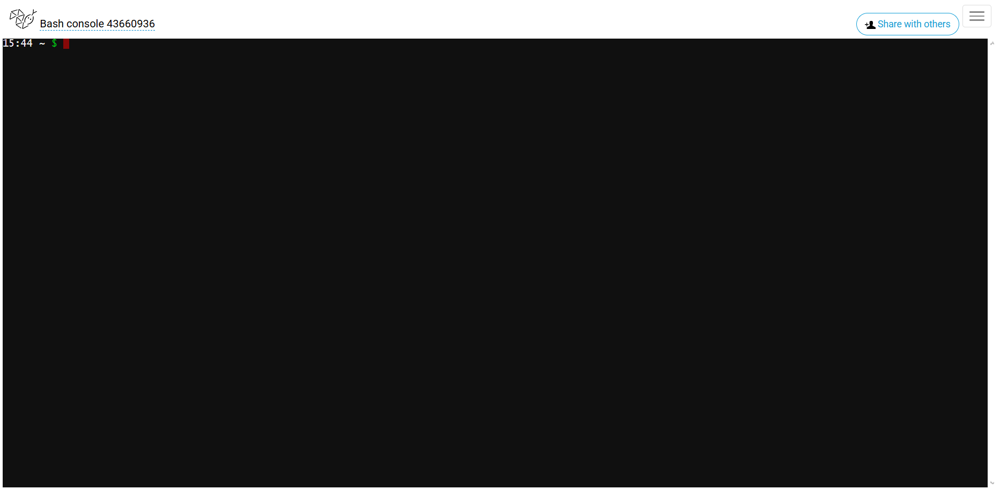

Esta consola permanecera abierta siempre y cuando no la borre, esta se encuentra de forma más accesible en el apartado Dashboard

## 2. Clonar el repositorio

Tras esto, procedemos a clonar el repositorio de git:

```powershell
git clone https://github.com/Manuelgithuv/PetFun.git
```

y ejecutamos el comando "ls" para comprobar que se ha descargado correctamente:

```powershell
ls
```

Debería de quedar la consola tal que:

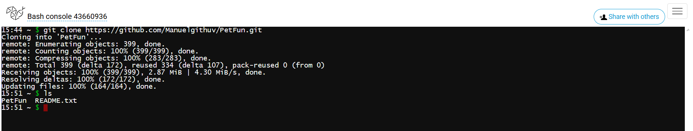

## 3. Crear un entorno virtual

Creamos un entorno virtual mediante el comando:

```powershell
mkvirtualenv --python=/usr/bin/python3.12 .venv
```

Tras esto, en la propia terminal se verá como se ha activado el entorno creado:

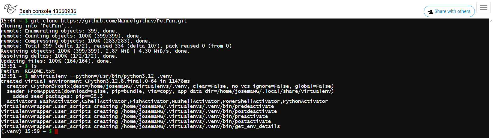

## 4. Intalar las dependencias

Nos metemos dentro del proyecto y instalamos todas las dependencias necesarias establecidas en el archivo requirements.txt:

```powershell
cd PetFun
pip install -r requirements.txt
```

Tras esto, en la propia terminal se verá como se han instalado todas las dependencias necesarias:

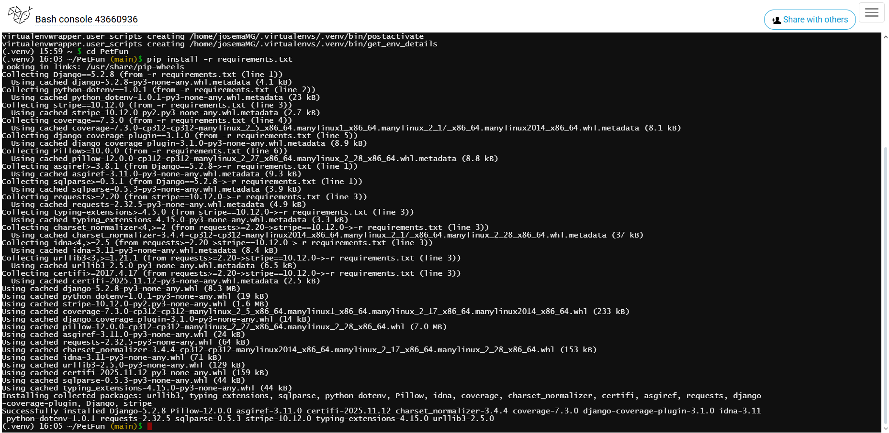

## 5. Configurar el “Web app” en PythonAnywhere

Seleccione las barras de la esquina superior derecha y vaya al apartado "Web"

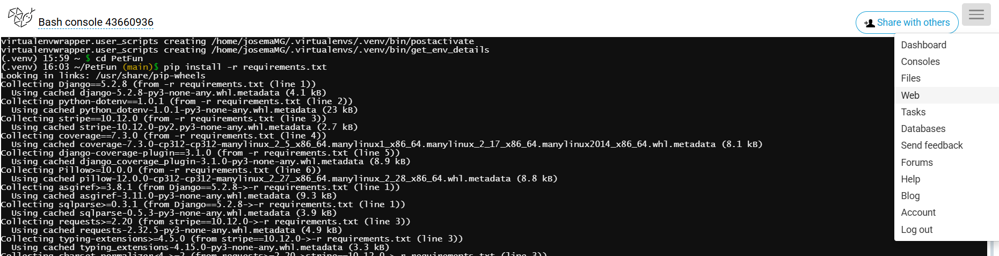

Ahora en esta pantalla clickee en el apartado "Add a new web app"

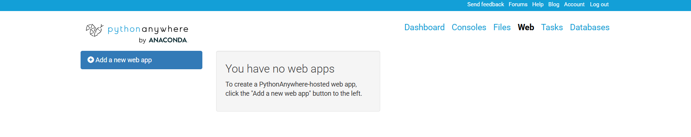

En esta pantalla se abrirá un panel, pulse el boton "Next". Tras esto, el panel cambiará y ahora tendra que seleccionar la opción "Manual configuration". Después clickee en "Python 3.12" y tras esto en "Next".

Tras esto se creara la web "[tu usuario].pythonanywhere.com".

En la sección de Virtualenv de esa web app, indique la ruta de su virtualenv (/home/tu usuario/.virtualenvs/.venv) y guárdalo.

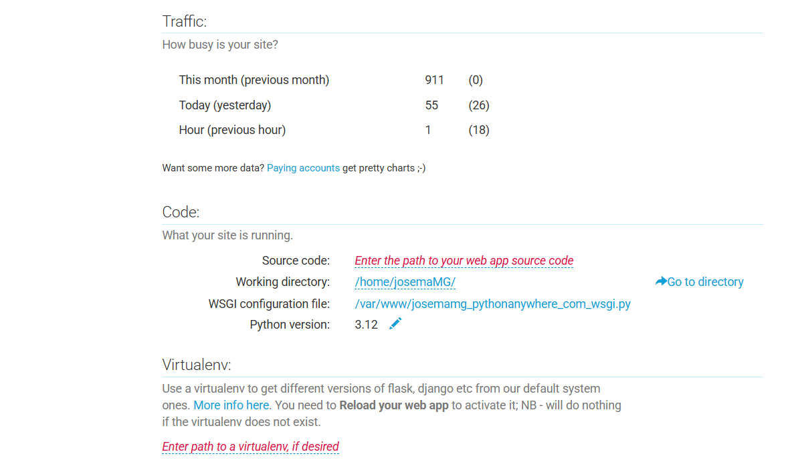

Debería de quedar algo tal que así:

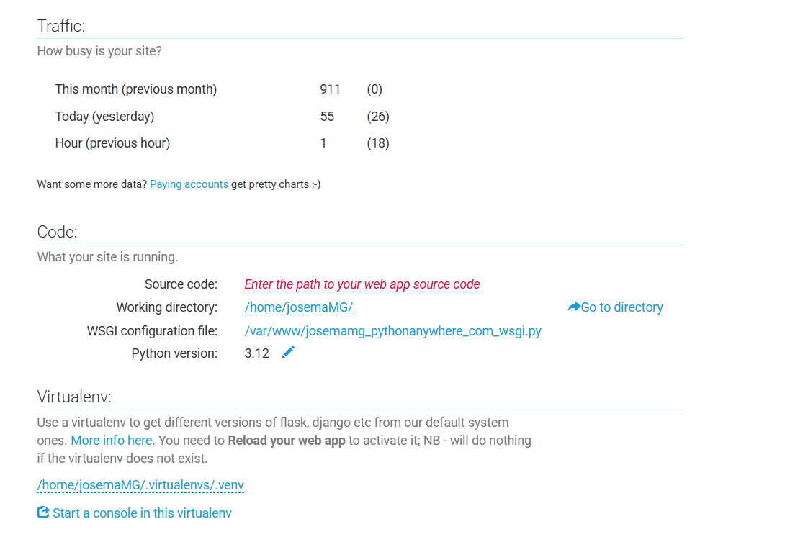

## 6. Editar el archivo WSGI para apuntar a tu proyecto

Desde la propia pestaña Web, haga clic en el enlace del archivo WSGI configuration file (algo como /var/www/tuusuario_pythonanywhere_com_wsgi.py). Abra el editor.

 
<!-- Esta es la misma imagen que la anterior para mostrar que la sección es la de justo arriba de Virtualenv -->

Borre lo que haya en el archivo y ponga. **OJO, donde ponga "tuusuario" ponga su nombre de usuario, si no, no funcionara**:

```powershell
# +++++++++++ DJANGO +++++++++++
import os
import sys

path = '/home/tuusuario/PetFun'
if path not in sys.path:
    sys.path.insert(0, path)

os.environ['DJANGO_SETTINGS_MODULE'] = 'petfun.settings'

from django.core.wsgi import get_wsgi_application
application = get_wsgi_application()

```

Dentro del archivo modificado con  mi nombre de usuario queda un archivo tal que:

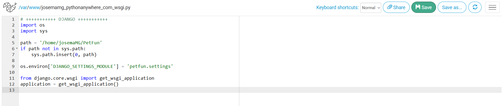 

Como puede ver en la imagen ahora pulse en el boton de guardar "Save".

## 7. Establecer los archivos estáticos del proyecto.

Vuelva a darle a las tres barras horizontales (en la esquina superior derecha) y vaya a "Files". Entre en PetFun/ → petfun/ → settings.py.

En la línea 52 encontrara "ALLOWED_HOSTS" cambie esa línea completa por esta. **OJO, donde ponga "tuusuario" ponga su nombre de usuario, si no, no funcionara**:

```powershell
ALLOWED_HOSTS = ['tuusuario.pythonanywhere.com']
```

Justo debajo aparece las variables: 

```powershell
MEDIA_URL = '/media/'
MEDIA_ROOT = BASE_DIR / 'media'
```

Pues copie este código ponga justo abajo.  **OJO, donde ponga "tuusuario" ponga su nombre de usuario, si no, no funcionara**:

```powershell
STATIC_URL = '/static/'

STATIC_ROOT = '/home/tuusuario/PetFun/staticfiles'

STATICFILES_DIRS = [
    '/home/tuusuario/PetFun/media/products',
]
```
El archivo tiene queda, en mi caso, tal que:

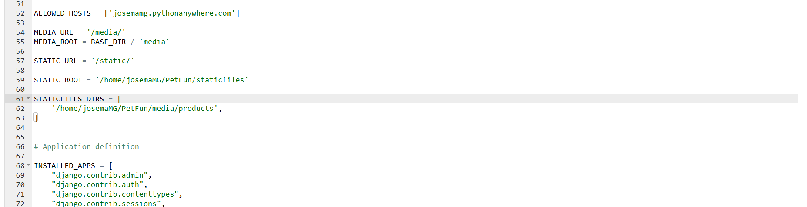

Tras esto, guarde los cambios (boton "Save") y en las tres barras horizontales, vaya a "Web" y vaya al apartado de "Virtualenv" para abrir la terminal con el entorno virtual activado:

 
<!-- Esta imagen se ha usado para enseñar que se puede abrir la maquina virtual con el .venv desde ahi-->

Deberia de salir esta terminal:


Entonces copie en la terminal. Esto lo que hará es crear la carpeta staticfiles **OJO, donde ponga "tuusuario" ponga su nombre de usuario, si no, no funcionara**:

```powershell
mkdir /home/tuusuario/PetFun/staticfiles
```

En mi caso:


Y por último, ejece este comando para copiar los archivos de una carpeta a otra.

```powershell
workon venv
cd ~/PetFun
python manage.py collectstatic
```

Debería quedar algo tal que:

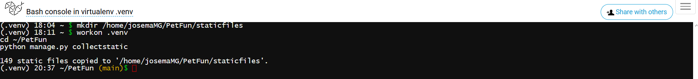


## 8. Realizar las migraciones.

Para realizar las migraciones solo tiene que usar el comando:

```powershell
python manage.py migrate
```

El terminal debería de quedar como se muestra a continuación:

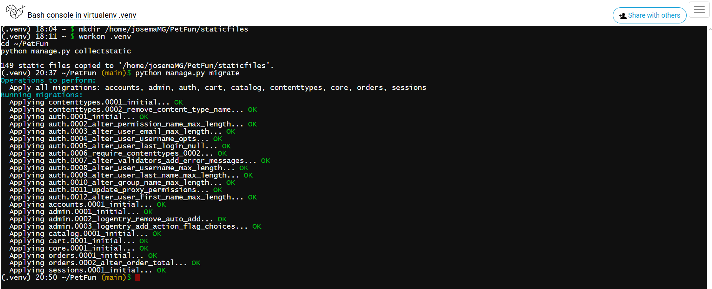


## 9. Establecer el .env.

Vuelva a darle a las tres barras horizontales (en la esquina superior derecha) y vaya a "Files" para acto seguido ir a PetFun/.

Dentro tiene que crear el archivo vacío ".env"

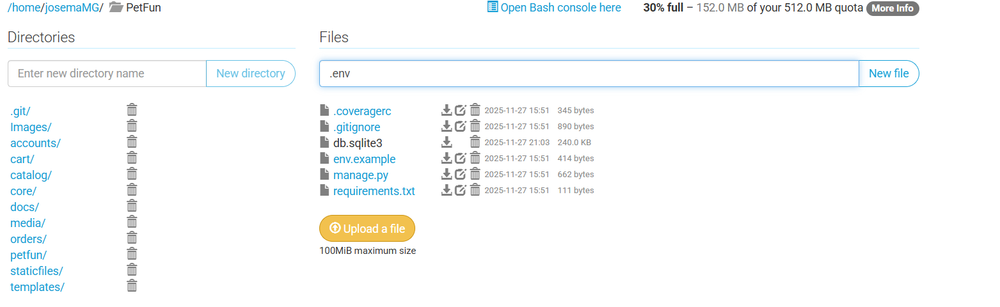

Metase dentro del archivo y pegue lo siguiente:

```powershell
DEBUG=1
ALLOWED_HOSTS='josemamg.pythonanywhere.com'
SECRET_KEY=change-me

STRIPE_SECRET_KEY=
STRIPE_PUBLISHABLE_KEY=pk_test_51SSkv3JfoY0bVIIdPwIeMBGflhjE8LOlC05L2LLOtKhz6BFywynE9B1h0kkkjgS7zmnBckDcPZ52TIbBEVvfhMaY00JrZyb6Ed

EMAIL_BACKEND=django.core.mail.backends.smtp.EmailBackend
EMAIL_HOST=smtp.gmail.com
EMAIL_PORT=587
EMAIL_USE_TLS=1
EMAIL_USE_SSL=0
EMAIL_HOST_USER=noreply.petfun@gmail.com
EMAIL_HOST_PASSWORD=fdat lszp oapy nntl
DEFAULT_FROM_EMAIL=noreply.petfun@gmail.com
```

Debería de quedar tal que:


Después guardelo.


## 10. Establecer la ruta de archivos a usar y listo.

Vaya a la sección "Web" mediante el icono de las líneas horizontales y busque la sección "Static files"

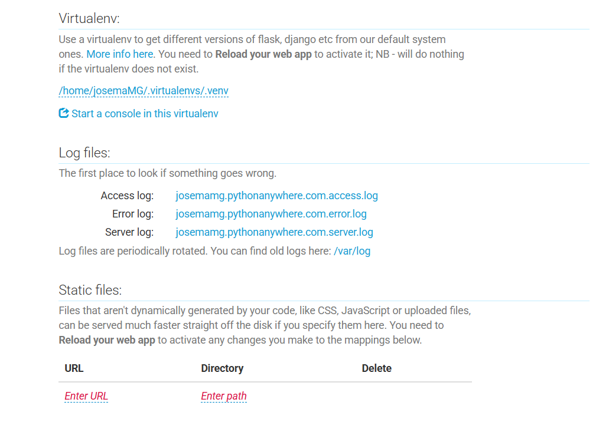

En esta tiene que poner de URL = /static/  y Directory = /home/tuusuario/PetFun/staticfiles. **OJO, donde ponga "tuusuario" ponga su nombre de usuario, si no, no funcionara**

En mi caso sería:

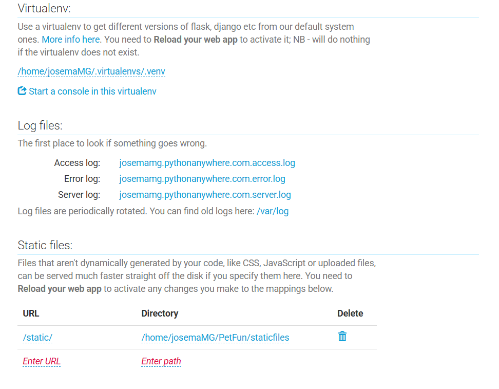

Y por último, recargar el dominio (boton "reload").

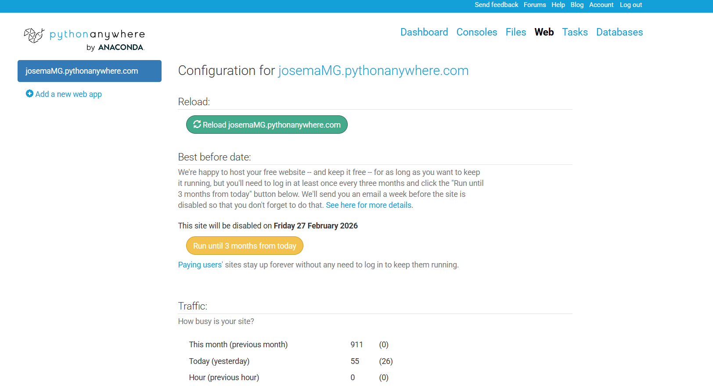

Y listo, ¡ya estaría PetFun funcionando en su dominio personal! 

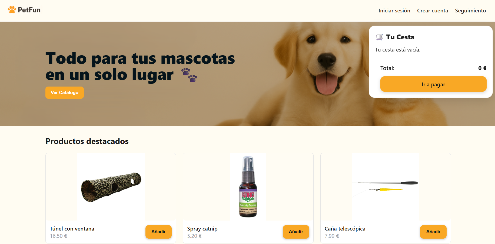